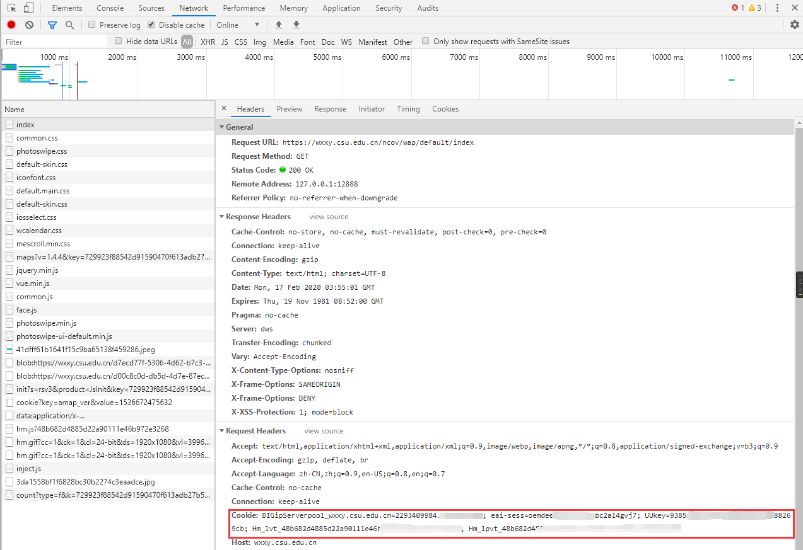
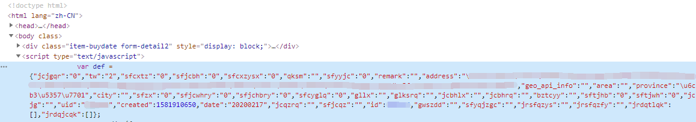

# Tools-for-CSU

该项目旨在逐步完成一个可以方便日常学习生活的脚本库。

现有项目：

* 移动网络断网重连
* 每日健康定时签到
* 文件批量重命名工具

* 近代史在线听课代刷程序

## 移动网络断网重连

这个小工具能自动监测网络状态，并在掉线后能自动重连。（仅适用于中南大学中国移动网络）

此版本针对于 Linux 平台编写，并且需要用户自行设计计时器反复调用，已针对Python2与Python3进行优化。

**多平台**

Linux：<https://github.com/wolfbolin/csu-keep-online>

MacOS：<https://github.com/fr0der1c/always-online>

操作说明见相关文件夹

## nCOV疫情期间签到脚本

在指定时间自动完成签到，我真的不想每天定闹钟签到了

配置修改方案详见截图






## 批量重命名工具

使用该工具前应先准备好学生的姓名与学号，并以json的数据格式存储在本地。

json文件样例：

```json
{
    "学生1": "39011606**",
    "学生2": "39011606**"
}
```

根据程序提示输入指定的命名格式，以`dd`代表学生学号，以`ss`代表学生的姓名。

系统在搜索匹配的信息时只按照学生姓名进行正则，若需要按照学号匹配请修改json中的键值。

最后指定批量修改路径即可完成文件名的批量扫描修改，文件名的修改不包含子文件和子文件夹。

**运行环境 python3**

## 近代史在线听课代刷程序

在使用软件之前请先登录在线听课系统

程序运行后打开需要代刷的听课页面，通过网络数据抓包填入cookies数据。

在网页上点击视频进行播放，在其开始稳定播放后暂停播放，将其暂停时发出的网络请求地址填入脚本内。

回车后等待系统确认，当出现包含`true`的返回信息时即说明该视频的代刷已完成。

**运行环境 python3以及相关插件**

## 网络安全知识竞赛刷题程序（已过期）

在使用软件之前请先登录网络安全知识竞赛系统http://yiban.csu.edu.cn/csuNSKC/

程序运行后填入浏览器中的cookies信息，并选择刷题模式。

* 0  模式为自动模拟题刷题

* 1  模式为初始题目刷题

信息输入后回车，并期待完成的好消息。

（没有写入防止错误输入的代码，请自行确认信息的正确性）

**运行环境 python3以及相关插件**

